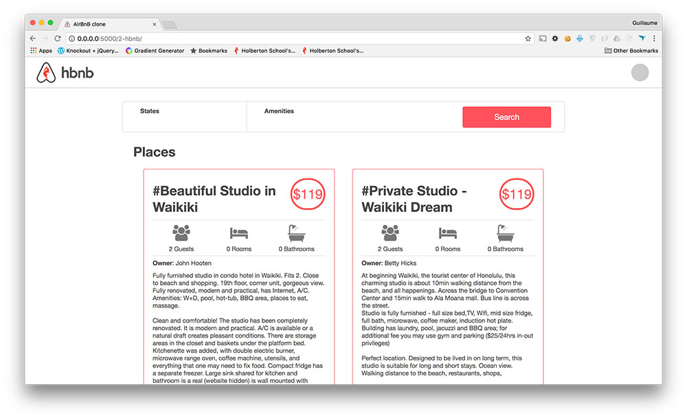

## . AirBnB clone - Web dynamic
### Resources

**Read or watch**:

- [Selector](https://jquery-tutorial.net/selectors/using-elements-ids-and-classes/)
- [Get and set content](https://jquery-tutorial.net/dom-manipulation/getting-and-setting-content/)
- [Manipulate CSS classes](https://jquery-tutorial.net/dom-manipulation/getting-and-setting-css-classes/)
- [Manipulate DOM elements](https://jquery-tutorial.net/dom-manipulation/the-append-and-prepend-methods/)
- [Document ready](https://learn.jquery.com/using-jquery-core/document-ready/)
- [Introduction to AJAX](https://jquery-tutorial.net/ajax/introduction/)
- [GET & POST request](https://jquery-tutorial.net/ajax/the-get-and-post-methods/)
- [HTTP access control (CORS)](https://developer.mozilla.org/en-US/docs/Web/HTTP/CORS)

## More Info

### Import JQuery

```
<head>
    <script src="https://code.jquery.com/jquery-3.2.1.min.js"></script>
</head>
```

### Before starting the project…

You will work on a codebase using [Flasgger](https://intranet.alxswe.com/rltoken/VmGDpw_DCN16OJt_UoqsDQ "Flasgger"), you will need to install it locally first before starting the RestAPI:

```
$ sudo apt-get install -y python3-lxml
$ sudo pip3 install flask_cors # if it was not installed yet
$ sudo pip3 install flasgger
```

If the RestAPI is not starting, please read the error message. Based on the(ses) error message(s), you will have to troubleshoot potential dependencies issues.

Here some solutions:

#### `jsonschema` exception

```
$ sudo pip3 uninstall -y jsonschema 
$ sudo pip3 install jsonschema==3.0.1
```

#### `No module named 'pathlib2'`

```
$ sudo pip3 install pathlib2
```

### Expose ports from your Vagrant

In your `Vagrantfile`, add this line for each port forwarded

```
# I expose the port 5001 of my vm to the port 5001 on my computer
config.vm.network :forwarded_port, guest: 5001, host: 5001 
```

if you need to expose other ports, same line but you will need to replace the “guest port” (inside your vagrant) and your “host port” (outside your vagrant, used from your browser for example)

It’s important in your project, to use the AirBnB API with the port `5001`


#### Install Flask

```shell
$ pip3 install Flask
```

### Tasks

<details>
<summary>1. Cash only</summary>

Create a script that initiates a Flask web application:

- Use `web_flask` as a base, and copy the following into the `web_dynamic` folder: `web_flask/static`, `web_flask/templates/100-hbnb.html`, `web_flask/__init__.py`, and `web_flask/100-hbnb.py`.
- Change the name of `100-hbnb.py` to `0-hbnb.py`.
- Change the name of `100-hbnb.html` to `0-hbnb.html`.
- Modify `0-hbnb.py` to replace the current route with `/0-hbnb/`.

**If `100-hbnb.html` is not available, substitute it with `8-hbnb.html` instead.**

```shell
guillaume@ubuntu:~/AirBnB_v4$ HBNB_MYSQL_USER=hbnb_dev HBNB_MYSQL_PWD=hbnb_dev_pwd HBNB_MYSQL_HOST=localhost HBNB_MYSQL_DB=hbnb_dev_db HBNB_TYPE_STORAGE=db python3 -m web_dynamic.0-hbnb
* Running on http://0.0.0.0:5000/ (Press CTRL+C to quit)
....
```

One issue you might encounter is the asset caching performed by Flask.

To circumvent this, append a query string to each asset:

In `0-hbnb.py`, introduce a variable `cache_id` to the `render_template`. This variable should be assigned a UUID (`uuid.uuid4()`).

In `0-hbnb.html`, append this `cache_id` variable as a query string to each `<link>` tag URL.

```shell
guillaume@ubuntu:~/AirBnB_v4$ curl -s -XGET http://0.0.0.0:5000/0-hbnb/ | head -6
<!DOCTYPE HTML>
<html lang="en">
  <head>
    <meta charset="UTF-8" />
    <link rel="stylesheet" type="text/css" href="../static/styles/4-common.css?e211c9eb-7d17-4f12-85eb-4d50fa50cb1d" />
    <link rel="stylesheet" type="text/css" href="../static/styles/3-header.css?e211c9eb-7d17-4f12-85eb-4d50fa50cb1d" />
guillaume@ubuntu:~/AirBnB_v4$ curl -s -XGET http://0.0.0.0:5000/0-hbnb/ | head -6
<!DOCTYPE HTML>
<html lang="en">
  <head>
    <meta charset="UTF-8" />
    <link rel="stylesheet" type="text/css" href="../static/styles/4-common.css?f834413e-0aa9-4767-b64a-c92db9cb1f82" />
    <link rel="stylesheet" type="text/css" href="../static/styles/3-header.css?f834413e-0aa9-4767-b64a-c92db9cb1f82" />
guillaume@ubuntu:~/AirBnB_v4$ 
```
***
**Repo:**
- Directory: `web_dynamic`
- File: `0-hbnb.py, templates/0-hbnb.html`
</details>

<details>
<summary>2. Select some Amenities to be comfortable!</summary>

Let's make the filters section dynamic!

Modify the file `1-hbnb.py` (based on `0-hbnb.py`) to replace the route `0-hbnb` with `1-hbnb`.

Create a new template `1-hbnb.html` (based on `0-hbnb.html`) and make the following updates:

- Import JQuery in the `<head>` tag.
- Import the JavaScript file `static/scripts/1-hbnb.js` in the `<head>` tag.
    - In `1-hbnb.html` and subsequent HTML files, append the variable `cache_id` as a query string to the above `<script>` tag.
- Add an `<input type="checkbox">` tag to the `li` tag of each amenity.
- The new checkbox should be positioned 10px to the left of the Amenity name.
- Add the attribute `data-id=":amenity_id"` to the `input` tags of each amenity (`<li>` tag). This will allow us to retrieve the Amenity ID from the DOM.
- Add the attribute `data-name=":amenity_name"` to the `input` tags of each amenity (`<li>` tag). This will allow us to retrieve the Amenity name from the DOM.

Write a JavaScript script (`static/scripts/1-hbnb.js`):

- The script should only be executed when the DOM is loaded.
- JQuery must be used.
- Monitor changes on each `input` checkbox tag:
    - If the checkbox is checked, store the Amenity ID in a variable (dictionary or list).
    - If the checkbox is unchecked, remove the Amenity ID from the variable.
    - Update the `h4` tag inside the `div` Amenities with the list of Amenities that are checked.

As example:


***
**Repo:**
- Directory: `web_dynamic`
- File: `1-hbnb.py, templates/1-hbnb.html, static/scripts/1-hbnb.js`
</details>

<details>
<summary>3. API status</summary>

Before making requests to the HBNB API, it's important to know its status.

Update the API entry point (`api/v1/app.py`) by replacing the existing CORS `CORS(app, origins="0.0.0.0")` with `CORS(app, resources={r"/api/v1/*": {"origins": "*"}})`.

Change the route from `1-hbnb` to `2-hbnb` in the file `2-hbnb.py` (which is based on `1-hbnb.py`).

Create a new template `2-hbnb.html` (based on `1-hbnb.html`) and make the following updates:

- Replace the JavaScript import in the `<head>` tag from `static/scripts/1-hbnb.js` to `static/scripts/2-hbnb.js`.
- Add a new `div` element in the `header` tag with the following specifications:
    - The ID attribute should be `api_status`.
    - It should be aligned to the right.
    - It should be a circle with a diameter of 40px.
    - It should be vertically centered.
    - It should be 30px from the right border.
    - The background color should be #cccccc.
- Add a new class `available` for this new element in `web_dynamic/static/styles/3-header.css` with a background color of #ff545f.

Write a JavaScript script (`static/scripts/2-hbnb.js`):

- This script should be based on `1-hbnb.js`.
- It should make a request to `http://0.0.0.0:5001/api/v1/status/`:
    - If the status is “OK”, add the class `available` to the `div#api_status`.
    - If the status is not “OK”, remove the class `available` from the `div#api_status`.

To start the API on port 5001, use the following command:

```shell
guillaume@ubuntu:~/AirBnB_v4$ HBNB_MYSQL_USER=hbnb_dev HBNB_MYSQL_PWD=hbnb_dev_pwd HBNB_MYSQL_HOST=localhost HBNB_MYSQL_DB=hbnb_dev_db HBNB_TYPE_STORAGE=db HBNB_API_PORT=5001 python3 -m api.v1.app
...
```

For example:




***
**Repo:**
- File: `api/v1/app.py, web_dynamic/2-hbnb.py, web_dynamic/templates/2-hbnb.html, web_dynamic/static/styles/3-header.css, web_dynamic/static/scripts/2-hbnb.js`
</details>

<details>
<summary>4. Fetch places</summary>

Alter the route from `2-hbnb` to `3-hbnb` in the file `3-hbnb.py` (which is based on `2-hbnb.py`).

Create a new template `3-hbnb.html` (based on `2-hbnb.html`) and make the following updates:

- Replace the JavaScript import in the `<head>` tag from `static/scripts/2-hbnb.js` to `static/scripts/3-hbnb.js`.
- Remove the entire Jinja section that displays all places (all `article` tags).

Write a JavaScript script (`static/scripts/3-hbnb.js`):

- This script should be based on `2-hbnb.js`.
- It should make a request to `http://0.0.0.0:5001/api/v1/places_search/`:
    - The description of this endpoint can be found [Task 15 - search](https://github.com/meriembenayad/AirBnB_clone_v3). **If this endpoint is not available, you will need to add it to the API** (you can collaborate on creating this endpoint).
    - Send a `POST` request with `Content-Type: application/json` and an empty dictionary in the body - cURL version: `curl "http://0.0.0.0:5001/api/v1/places_search" -XPOST -H "Content-Type: application/json" -d '{}'`.
    - Iterate over the result of the request and create an `article` tag representing a `Place` in the `section.places`. (you can remove the Owner tag in the place description).

The final result should be the same as before, but now, places are loaded from the front-end, not from the back-end!

***
**Repo:**
- File: `web_dynamic/3-hbnb.py, web_dynamic/templates/3-hbnb.html, web_dynamic/static/scripts/3-hbnb.js`
</details>

<details>
<summary>5. Filter places by Amenity</summary>

Alter the route from `3-hbnb` to `4-hbnb` in the file `4-hbnb.py` (which is based on `3-hbnb.py`).

Create a new template `4-hbnb.html` (based on `3-hbnb.html`) and make the following updates:

- Replace the JavaScript import in the `<head>` tag from `static/scripts/3-hbnb.js` to `static/scripts/4-hbnb.js`.

Write a JavaScript script (`static/scripts/4-hbnb.js`):

- This script should be based on `3-hbnb.js`.
- It should make a new POST request to `places_search` when the `button` tag is clicked, with the list of checked Amenities.

Congratulations, you've implemented the first filter! Enjoy your enhanced functionality!

***
**Repo:**
- File: `web_dynamic/4-hbnb.py, web_dynamic/templates/4-hbnb.html, web_dynamic/static/scripts/4-hbnb.js`
</details>

<details>
<summary>6. States and Cities</summary>

Now, let's apply the same steps to the State and City filter:

Change the route from `4-hbnb` to `100-hbnb` in the file `100-hbnb.py` (which is based on `4-hbnb.py`).

Create a new template `100-hbnb.html` (based on `4-hbnb.html`) and make the following updates:

- Replace the JavaScript import in the `<head>` tag from `static/scripts/4-hbnb.js` to `static/scripts/100-hbnb.js`.
- Add a new tag: `<input type="checkbox">` to all `li` tags of each state and city.
- The new checkbox should be positioned 10px to the left of the State or City name.
- Add the attribute `data-id=":state_id"` and `data-name=":state_name"` to all `input` tags of each state (`<li>` tag).
- Add the attribute `data-id=":city_id"` and `data-name=":city_name"` to all `input` tags of each city (`<li>` tag).

Write a JavaScript script (`static/scripts/100-hbnb.js`):

- This script should be based on `4-hbnb.js`.
- It should listen for changes on each `input` checkbox tag:
    - If the checkbox is checked, store the State or City ID in a variable (dictionary or list).
    - If the checkbox is unchecked, remove the State or City ID from the variable.
    - Update the `h4` tag inside the `div` Locations with the list of checked States or Cities.
- When the `button` tag is clicked, it should make a new POST request to `places_search` with the list of checked Amenities, Cities, and States.

***
**Repo:**
- File: `web_dynamic/100-hbnb.py, web_dynamic/templates/100-hbnb.html, web_dynamic/static/scripts/100-hbnb.js`
</details>

<details>
<summary>7. Reviews</summary>

Here's a revised version of your instructions:

Let's introduce a new feature that allows users to show and hide reviews!

Change the route from `100-hbnb` to `101-hbnb` in the file `101-hbnb.py` (which is based on `100-hbnb.py`).

Create a new template `101-hbnb.html` (based on `100-hbnb.html`) and make the following updates:

- Replace the JavaScript import in the `<head>` tag from `static/scripts/101-hbnb.js` to `static/scripts/101-hbnb.js`.
- Design the list of reviews as per the specifications from this [task 9 - Web Static](https://github.com/meriembenayad/AirBnB_clone).
- Add a `span` element to the right of the `H2` “Reviews” with the value “show” (ensure to add all necessary attributes to implement this feature).

Write a JavaScript script (`static/scripts/101-hbnb.js`):

- This script should be based on `100-hbnb.js`.
- It should listen for clicks on the `span` next to the Reviews `h2`:
    - If clicked, fetch, parse, display reviews and change the text to “hide”.
    - If the text is “hide”, remove all Review elements from the DOM.
    - This button should act as a toggle to fetch/display and hide reviews.

***
**Repo:**
- File: `web_dynamic/101-hbnb.py, web_dynamic/templates/101-hbnb.html, web_dynamic/static/scripts/101-hbnb.js`
</details>

***
### AUTHORS:
- Meriem Ben Ayad
- Thami Baladi
